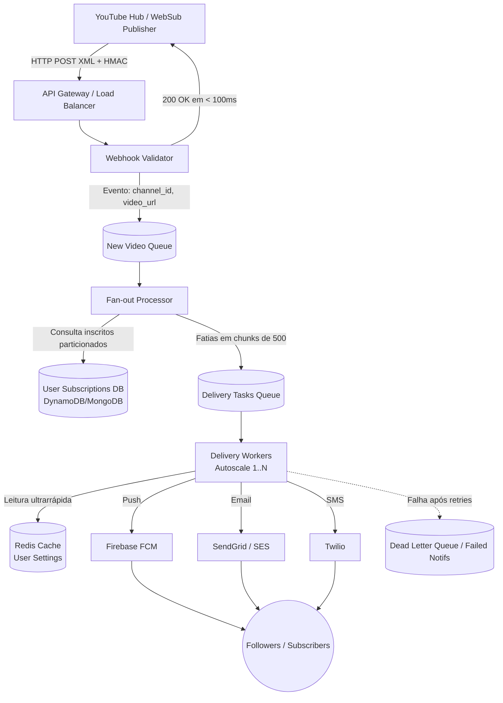

# NotifyMe 🔔

Sistema de alta escala para ingestão de eventos do YouTube (WebSub) e entrega resiliente de notificações multicanal (Push, E-mail, SMS).

---

## 📌 1. Requisitos do Sistema

### Requisitos Funcionais (O que o sistema FAZ)
* **Receber avisos do YouTube:** Identificar automaticamente quando um canal posta vídeo novo via WebSub (PubSubHubbub).
* **Seguir canais:** Permitir ao usuário escolher de quais criadores quer receber alertas.
* **Enviar notificações:** Disparar alertas via Push Notification, E-mail e SMS.
* **Escolha de canal de envio:** Usuário define a preferência de canal de envio (ex.: apenas Push, apenas E-mail, múltiplos).
* **Histórico:** Exibir notificações passadas dentro do aplicativo.

### Requisitos Não Funcionais (Como o sistema se COMPORTA)
* **Escalabilidade:** Suportar milhões de notificações simultâneas em picos de grandes canais.
* **Baixa Latência:** Entrega do aviso ao usuário final em menos de 5 segundos.
* **Confiabilidade:** Garantir que nenhuma notificação seja perdida (at-least-once delivery com idempotência).
* **Segurança:** Validar se a notificação originou-se legitimamente do YouTube via HMAC Signature / WebSub verification (evitar fakes).
* **Disponibilidade:** Manter o fluxo de envio ativo mesmo se serviços secundários (como o banco de histórico) estiverem fora do ar.

---

## 🏗️ 2. Arquitetura em Camadas (Desacoplamento de Ponta a Ponta)

### 1. Ingestão & Validação (Webhook Handler)
* **Componentes:** *API Gateway / Load Balancer* (Entry Point) + *Webhook Validator* (Node.js/TypeScript).
* **Fluxo:** Recebe a requisição `HTTP POST (XML/HMAC Signature)` enviada pelo *YouTube Hub (WebSub Publisher)*, valida a assinatura criptográfica para garantir a segurança e despacha um evento leve (`channel_id`, `video_url`) para a fila.
* **Métrica:** Retorna resposta `200 OK` ao YouTube em menos de 100ms.

### 2. Descoberta & Fan-out (Fan-out Service)
* **Componente:** *Fan-out Processor* (Worker especializado em consultas).
* **Fluxo:** Consome o evento da **New Video Queue**, consulta os inscritos no banco particionado (*User Subscriptions Sharded* via DynamoDB/MongoDB com chave de partição por `channel_id`), fatia a lista de seguidores em *chunks* de 500 usuários e enfileira as tarefas individuais na fila **Delivery Tasks**.

### 3. Mensageria & Cache (O Coração da Escala)
* **Filas:** RabbitMQ, Apache Kafka ou AWS SQS armazenam as tarefas de envio em trânsito, garantindo desacoplamento e tolerância a lentidões externas.
* **Cache:** **Redis Cache (User Settings)** armazena as preferências de notificação do usuário em memória para leitura ultrarrápida.

### 4. Execução & Entrega (Execution & Delivery)
* **Componente:** **Delivery Workers (Autoscale 1..N)** com capacidade de escalonamento automático de tarefas (*process tasks autoscale*).
* **Fluxo:**
  1. Consome o ID do usuário e consulta sua preferência no **Redis Cache**.
  2. Roteia a mensagem para o serviço correspondente.
  3. **Tratamento de Falhas:** Em caso de falhas repetidas da API externa, aplica **exponential backoff** com jitter e move a mensagem para a **DLQ (Failed Notifs / Dead Letter Queue)** para reprocessamento sem perda de dados.

### 5. Provedores Externos & Destinatários (External Providers & Clients)
* **Push Notification:** Roteado via **Firebase FCM (Push)** $\rightarrow$ *deliver push*.
* **E-mail:** Roteado via **SendGrid / SES (Email)** $\rightarrow$ *deliver email*.
* **SMS:** Roteado via **Twilio (SMS)** $\rightarrow$ *deliver SMS*.
* **Destino:** **Followers / Subscribers** (usuários finais).
