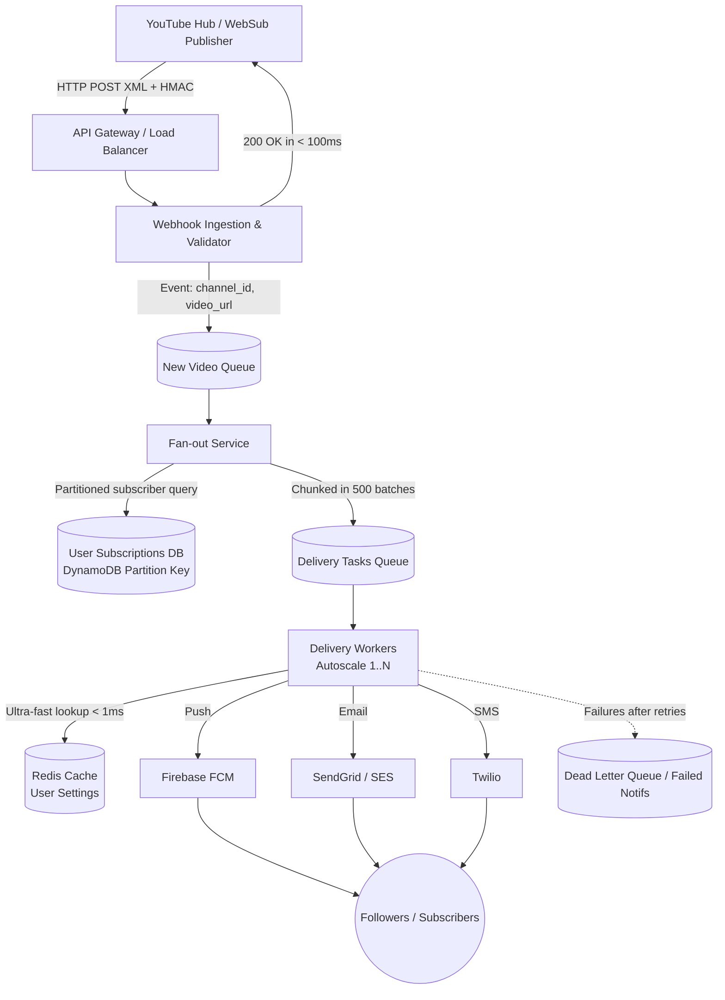

# NotifyMe 

High-scale event-driven notification engine for YouTube WebSub (PubSubHubbub) ingestion and resilient multi-channel delivery (Push, Email, SMS).

---

##  1. System Requirements

### Functional Requirements (What the system DOES)
* **Ingest YouTube Updates:** Automatically detect new video uploads via WebSub (PubSubHubbub).
* **Follow Channels:** Allow users to subscribe to creator channels to receive alerts.
* **Multi-Channel Dispatch:** Send notifications via Push (FCM), Email (SendGrid/SES), and SMS (Twilio).
* **Delivery Preferences:** Enable users to define preferred channels (e.g., Push only, Email only, or multi-channel).
* **Notification History:** Display past notification events within the application.

### Non-Functional Requirements (How the system BEHAVES)
* **Scalability:** Handle millions of simultaneous notifications during traffic spikes for large channels.
* **Low Latency:** End-to-end delivery from webhook ingestion to user device in less than 5 seconds.
* **Reliability:** At-least-once delivery guarantee with dead-letter queue (DLQ) recovery and idempotency.
* **Security:** Cryptographically verify webhook authenticity via HMAC-SHA1 signatures from YouTube to prevent spoofing.
* **High Availability:** Maintain delivery pipeline uptime even during transient outages of secondary databases.

---

##  2. Layered Architecture (Decoupled End-to-End Flow)

### 1. Ingestion & Validation (Webhook Handler)
* **Components:** *API Gateway / Load Balancer* + *Webhook Controller & Service* (Spring Boot).
* **Flow:** Receives `HTTP POST (XML/HMAC Signature)` from *YouTube Hub (WebSub Publisher)*, verifies the cryptographic HMAC-SHA1 signature, and publishes a lightweight domain event (`channelId`, `videoUrl`) to RabbitMQ.
* **Metric:** Returns `200 OK` response to YouTube in under 100ms.

### 2. Discovery & Fan-out (Fan-out Service)
* **Component:** *Fan-out Processor & Service*.
* **Flow:** Consumes from **New Video Queue**, checks Redis atomic lock for idempotency, queries subscribers from DynamoDB (partitioned by `channel_id`), slices followers into 500-user chunks, and enqueues individual tasks into **Delivery Tasks Queue**.

### 3. Messaging & Cache (The Core of Scale)
* **Broker:** RabbitMQ manages queues with exchange routing, retry with exponential backoff, and Dead Letter Exchanges (DLX/DLQ).
* **Cache:** **Redis Cache** stores user preferences in-memory for sub-millisecond lookups and atomic idempotency locks (`SETNX`).

### 4. Execution & Delivery (Delivery Workers)
* **Component:** **Delivery Workers** (Autoscaled).
* **Flow:**
  1. Consumes delivery task and retrieves user preferences from **Redis Cache** (< 1ms).
  2. Routes notifications to active channels using the Strategy pattern (`PushFcmProvider`, `EmailSendGridProvider`, `SmsTwilioProvider`).
  3. **Fault Tolerance:** Isolates channel errors, applies exponential backoff on retries, and forwards unrecoverable failures to the **DLQ (Dead Letter Queue)**.

### 5. External Providers & Clients
* **Push Notification:** Dispatched via **Firebase FCM (Push)**.
* **Email:** Dispatched via **SendGrid / AWS SES (Email)**.
* **SMS:** Dispatched via **Twilio (SMS)**.
* **Target Audience:** End-user subscribers and followers.
